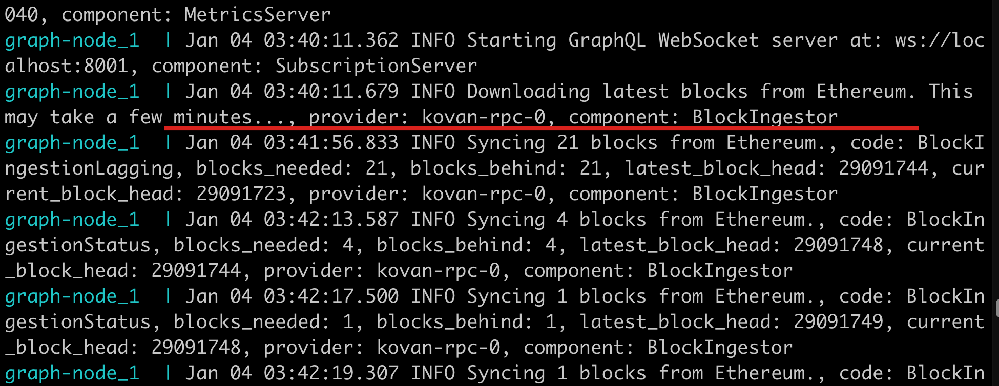
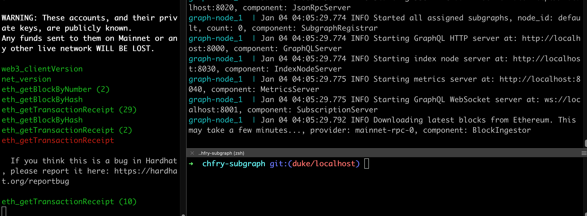
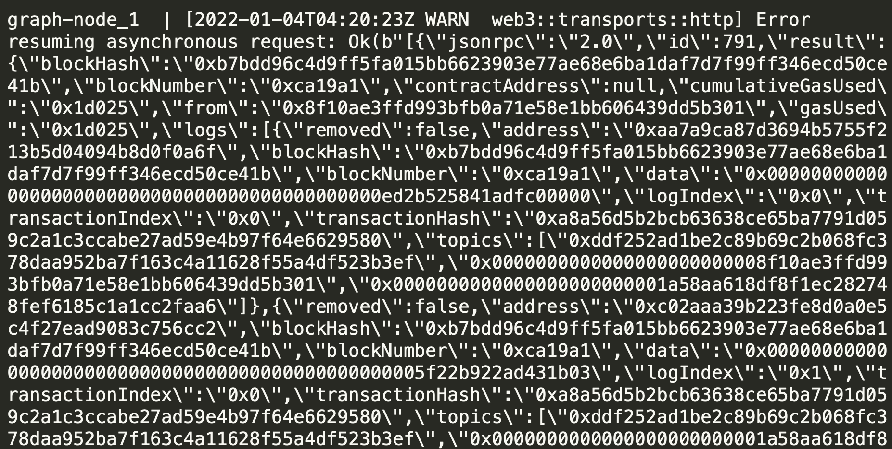

## alchemy

```sh
https://eth-mainnet.alchemyapi.io/v2/-qZ8NcwdvM8gsbxWyFl_Iw9znBN5UV3t
```

# 一、hardhat安装

```sh
#安装命令
npm install --save-dev hardhat

#创建工程
npx hardhat-》选择高级ts项目

#运行测试
npx hardhat accounts

#编译合约
npx hardhat compile

#单元测试
npx hardhat test

#运行脚本，部署合约
npx hardhat run scripts/deploy.ts

#启动节点node
npx hardhat node

#部署合约到本地node节点
npx hardhat run scripts/deploy.ts --network localhost
```

# 二、hardhat-fork启动

切换到Global VPN Mode

```sh
#启动成功
npx hardhat node --fork https://eth-mainnet.alchemyapi.io/v2/FKPQya5-fdpIyRPdKyr3KB2Q02hW626y --fork-block-number 13244836 --hostname 0.0.0.0%

#测试一下：
curl --data '{"method":"eth_blockNumber","params":[],"id":1,"jsonrpc":"2.0"}' -H "Content-Type: application/json" -X POST localhost:8545

#返回值：
{"jsonrpc":"2.0","id":1,"result":"0xca19a4"}  # 13,244,836 就是当前的块高                                    
```

创建script/send.ts

```js
import { network, ethers, waffle } from "hardhat";
import { Signer } from "ethers";

async function main() {
    await network.provider.request({
        method: "hardhat_impersonateAccount",
        params: ["0xE78388b4CE79068e89Bf8aA7f218eF6b9AB0e9d0"],
    });

    let [acc0] = await ethers.getSigners()
    console.log('acc0:', acc0.address);
    let bal = await ethers.provider.getBalance(acc0.address)
    //10000000000000000000000
    console.log('acc0 bal:', bal.toString());

    const signer = await ethers.provider.getSigner(
        "0xE78388b4CE79068e89Bf8aA7f218eF6b9AB0e9d0"
    );

    await signer.sendTransaction({
        to: acc0.address,
        value: ethers.utils.parseEther("20") // 20 ether
    });

    bal = await ethers.provider.getBalance(acc0.address)
    //10020000000000000000000
    console.log('new acc0 bal:', bal.toString());
}

main().catch((error) => {
    console.error(error);
    process.exitCode = 1;
});
```

运行：

```sh
hh run scripts/fork-test/send.ts --network localhost

curl --data '{"method":"eth_blockNumber","params":[],"id":1,"jsonrpc":"2.0"}' -H "Content-Type: application/json" -X POST localhost:8545

#块高加一
{"jsonrpc":"2.0","id":1,"result":"0xca19a5"}  # 13,244,837 
```


不知道为何使用配置文件不成功：

```sh
npx hardhat node //运行失败
```

配置如下：

```js
const config: HardhatUserConfig = {
    defaultNetwork: 'hardhat',
    solidity: "0.8.4",
    networks: {
        hardhat: { //<<<=== 这里的配置
            forking: {
                url: process.env.MAINNET_URL || "",
                blockNumber: 13596688,
            },
        },
        ropsten: {
            url: process.env.ROPSTEN_URL || "",
            accounts:
                process.env.PRIVATE_KEY !== undefined ? [process.env.PRIVATE_KEY] : [],
        },
    },
  
  //其他。。。。
}
```

# 三、graphnode安装

docker-compose.yml

```yaml
version: "3"
services:
  graph-node:
    image: graphprotocol/graph-node
    ports:
      - "8000:8000"
      - "8001:8001"
      - "8020:8020"
      - "8030:8030"
      - "8040:8040"
    links:
      - "ipfs:ipfs"
      - "postgres:postgres"
    depends_on:
      - ipfs
      - postgres
    environment:
      postgres_host: postgres
      postgres_user: graph-node
      postgres_pass: let-me-in
      postgres_db: graph-node
      ipfs: "ipfs:5001"
      ethereum: "mainnet:http://192.168.10.8:8545" #使用本机的，不要使用127.0.0.1这是docker
      RUST_LOG: info
  ipfs:
    image: ipfs/go-ipfs:v0.4.23
    ports:
      - "5001:5001"
    volumes:
      - ./data/ipfs:/data/ipfs
  postgres:
    image: postgres
    ports:
      - "5432:5432"
    command: ["postgres", "-cshared_preload_libraries=pg_stat_statements"]
    environment:
      POSTGRES_USER: graph-node
      POSTGRES_PASSWORD: let-me-in
      POSTGRES_DB: graph-node
    volumes:
      - ./data/postgres:/var/lib/postgresql/data

```

启动：

```sh
docker-compose up
```


## 1. 遇到的错误

1. 安装失败时，单独安装

```sh
docker pull graphprotocol/graph-node
```

2. 出现错误

```sh
Starting graphnode_postgres_1 ... error
listen tcp 0.0.0.0:5432: bind: address already in use
```

查一下：

```sh
#sudo lsof -i:5432
Password:
COMMAND  PID     USER   FD   TYPE             DEVICE SIZE/OFF NODE NAME
postgres 130 postgres    7u  IPv6 0xfa4b02f56640f4f3      0t0  TCP *:postgresql (LISTEN)
postgres 130 postgres    8u  IPv4 0xfa4b02f56641c98b      0t0  TCP *:postgresql (LISTEN)

#解决：
kill 130
```

启动成功!


## 2. 数据存储位置

我们在docker-compose.yaml中增加的数据卷是当前目录，所以会在当前目录创建一个data，graph的数据都写在data中：

```sh
- ./data/postgres:/var/lib/postgresql/data
```


## ==3. 同步数据失败==

1. 使用kovan，正常同步log



2. 使用hardhat fork错误log，会一直卡在Downloading阶段，左边是hardhat的log，会出现红色warning，最后会出现graphnode的log出现刷屏log error



刷屏error



==这个错误一直没有解决==，graphnode启动之后，整个请求全部被沾满了，部署合约都失败。

# 四、部署subgraph

找到chfry-subgraph

```sh
#创建
npm run create:local

#部署
npm run deploy:local
```

查询：

```js
{
  simpleBlocks(first: 5) {
    id
		height
    time
  }
}

```


```js
{
  useFlashloans(first: 5) {
    id
    user
    token
    tokenName
  }
  stakePoolClaimeds(first: 5) {
    id
    user
    amount
    token
  }
}

```

# 五、其他

## 1. 试试ganache

```sh
#$ ganache-cli --fork <ADD_YOUR_QUICKNODE_URL_HERE>@<block_number>

#这个会失败，错误：Error: Incompatible EIP155-based V 0 and chain id 1.  ganache-cli
ganache-cli --fork https://eth-mainnet.alchemyapi.io/v2/FKPQya5-fdpIyRPdKyr3KB2Q02hW626y@13244836 --hostname 0.0.0.0

#没想到还和块高有关系@10499400 可以成功，成功！
ganache-cli --fork https://eth-mainnet.alchemyapi.io/v2/FKPQya5-fdpIyRPdKyr3KB2Q02hW626y@10499400 --hostname 0.0.0.0
```


## 2. 注意事项

1. 使用热点的时候，mac的en0是：172.20.10.3，使用路由器的时候是：192.168.10.8, 别忘记切换
2. 使用热点的时候graphnode不会去链接hardhat，所以不要使用了
3. 使用wifi的时候，要切换到global vpn mode