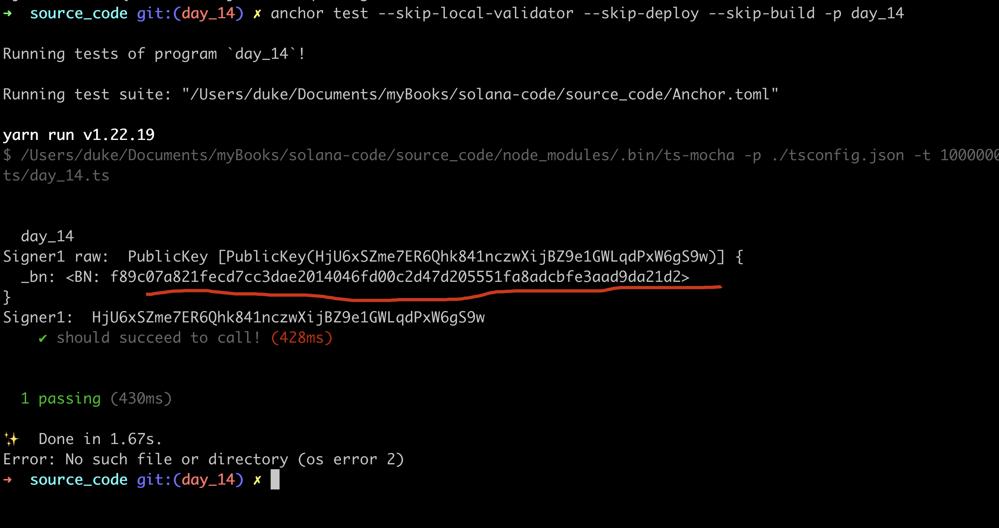
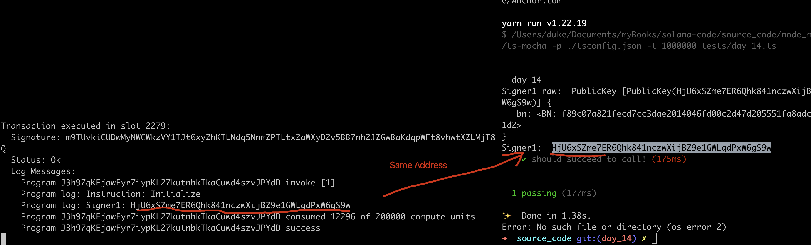
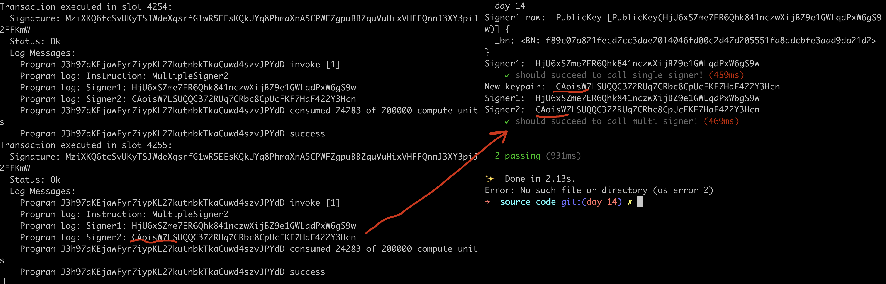
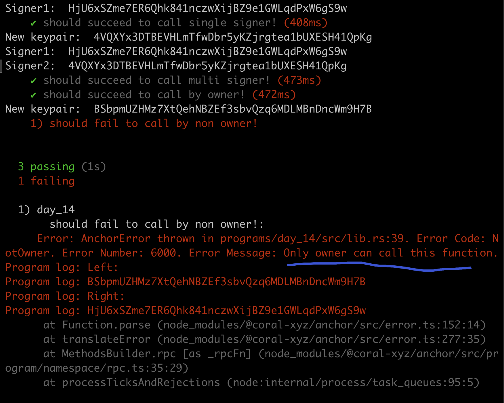

# Tx Origin onlyOwner

In Solidity,

-  `msg.sender` :represents the address that called or initiated a function call on a smart contract.
- `tx.origin`: is the wallet that signed the transaction.

In Solana, 

- `msg.sender`: don't have equivalent concept.
- `tx.origin`: solana has multiple tx.origins.


## Single Signer

```sh
anchor new day_14
```

udpate with following code:

```rust
use anchor_lang::prelude::*;

declare_id!("J3h97qKEjawFyr7iypKL27kutnbkTkaCuwd4szvJPYdD");

#[program]
pub mod day_14 {
    use super::*;

    pub fn single_signer(ctx: Context<Initialize>) -> Result<()> {
        let signer1: &mut Signer = &mut ctx.accounts.signer1;
        // Your logic here

        msg!("Signer1: {:?}", *signer1.key);
        Ok(())
    }
}

#[derive(Accounts)]
pub struct Initialize<'info> {
    #[account(mut)]
    pub signer1: Signer<'info>,
}
```

From the above code snippet, we have attached an signer1 to `Initialize` and use it within the function.

add test case in day_14.ts

```ts
import * as anchor from "@coral-xyz/anchor";
import { Program } from "@coral-xyz/anchor";
import { Day14 } from '../target/types/day_14';

describe("day_14", () => {
  anchor.setProvider(anchor.AnchorProvider.env());
  const program = anchor.workspace.Day14 as Program<Day14>;

  it("should succeed to call!", async () => {
    const tx = await program.methods.initialize().accounts(
      {
        signer1: program.provider.publicKey,
      }
    ).rpc();
    console.log('Signer1 raw: ', program.provider.publicKey);
    console.log('Signer1: ', program.provider.publicKey.toBase58());
  })
})
```

output:



same to what we log within the code:




## Multiple Signers

simply add one more signer, signer2, everything else remains unchange.

```rust
use anchor_lang::prelude::*;

declare_id!("J3h97qKEjawFyr7iypKL27kutnbkTkaCuwd4szvJPYdD");

#[program]
pub mod day_14 {
    use super::*;

		// the previous logic...
  
    pub fn multiple_signer2(ctx: Context<Initialize>) -> Result<()> {
        let signer1: &mut Signer = &mut ctx.accounts.signer1;
        let signer2: &Signer = &ctx.accounts.signer2;
        // Your logic here

        msg!("Signer1: {:?}", *signer1.key);
        msg!("Signer2: {:?}", *signer2.key);
        Ok(())
    }
}

#[derive(Accounts)]
pub struct Initialize<'info> {
    #[account(mut)]
    pub signer1: Signer<'info>,
    pub signer2: Signer<'info>, // <<--- add a new signer here!!
}
```

anchor build and deploy:

```sh
anchor build -p day_14
anchor deploy -p day_14
```

PLS NOTE: if failed, run this command to extend the unit, usually this will resolve your error.

```sh
solana program extend J3h97qKEjawFyr7iypKL27kutnbkTkaCuwd4szvJPYdD 2000000
```

update the testcase, with new test case.

```ts
  it("should succeed to call multi signer!", async () => {
    let newKeypair = anchor.web3.Keypair.generate();
    console.log('New keypair: ', newKeypair.publicKey.toBase58());

    const tx = await program.methods.multipleSigner2().
      accounts({
        signer1: program.provider.publicKey,
        signer2: newKeypair.publicKey,
      }).
      signers([newKeypair]).rpc();
    console.log('Signer1: ', program.provider.publicKey.toBase58());
    console.log('Signer2: ', newKeypair.publicKey.toBase58());
  })
```

key note:

1. we pass signer1 with `program.provider.publicKey` which is our local keypair.
2. we create a new keypair by anchor build function:  `anchor.web3.Keypair.generate();` and pass it as signer2
3. the default keypair is local keypair, no need to pass in the array: `signers([newKeypair])`, that's why there is only one in the arry.

test: 



it works as expected, cool!!


## OnlyOwner

This is the key feature in solidity, we use it to restrict a function's access to only the owner of the functions.

in Solana, using `#[access_control]` attribute from Anchor, we can also implement the onlyOwner pattern.

update the code, andd new function `restrict_to_owner`  in mod day_14 and `check` outside the mod

```rust
use anchor_lang::prelude::*;

declare_id!("J3h97qKEjawFyr7iypKL27kutnbkTkaCuwd4szvJPYdD");

// NOTE: Replace with you own address(Public key)
const OWNER: &str = "HjU6xSZme7ER6Qhk841nczwXijBZ9e1GWLqdPxW6gS9w";

#[program]
pub mod day_14 {
    use super::*;

		// The reset

    #[access_control(check(&ctx))]
    pub fn restrict_to_owner(ctx: Context<OnlyOwner>) -> Result<()> {
        // Your logic here
        msg!("Hello, i'm the true king, arise!");
        Ok(())
    }
}

fn check(ctx: &Context<OnlyOwner>) -> Result<()> {
    require_keys_eq!(
        ctx.accounts.signer_account.key(),
        OWNER.parse::<Pubkey>().unwrap(),
        OnlyOwnerError::NotOwner
    );
    Ok(())
}

#[derive(Accounts)]
pub struct OnlyOwner<'info> {
    signer_account: Signer<'info>,
}

#[error_code]
pub enum OnlyOwnerError {
    #[msg("Only owner can call this function")]
    NotOwner,
}
```

as you can see, there is a macro `    #[access_control(check(&ctx))]` above function: `restrict_to_owner` to verify the accessbility, the custom function: `check` defines the details, it will compare the signer and the OWNER we hardcoded above, and revert with a  custom error code if mismatch.

note: `require_keys_eq` is also a built-in macro by Anchor.


**Now we can Test**

add two more testcases, happy case and attack case each.

```sh
  it("should succeed to call by owner!", async () => {
    const tx = await program.methods.restrictToOwner().accounts({
      signerAccount: program.provider.publicKey,
    }).rpc();
  })

  it("should fail to call by non owner!", async () => {
    let newKeypair = anchor.web3.Keypair.generate();
    console.log('New keypair: ', newKeypair.publicKey.toBase58());
    const tx = await program.methods.restrictToOwner().accounts({
      signerAccount: newKeypair.publicKey,
    }).signers([newKeypair]).rpc();
  })
```

execute the test code, and get the result as expected.



we can use try-catch to cease the error, can take a refernce to  day_04, Error Handler.


## Modify The Owner

To cahnge the owner in a program, the pubKey assigned to the owner needs to store on-chain, which we will discuss in the later sessions.

As for now, we can just redeploy(upgrade) the bytecode as shown before.


## Key Takeaways

- no msg.sender in solana
- support multiple tx.origins in solana
- can get your local address by cmd:  `solana address`
- onlyOwner is doable.


## Links

- original article: https://www.rareskills.io/post/msg-sender-solana
- source code: https://github.com/dukedaily/solana-expert-code/tree/day_14