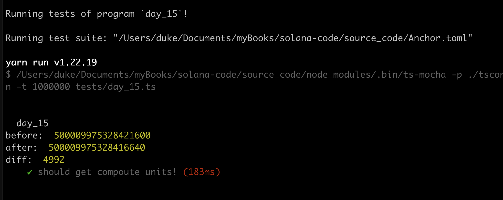

# TxFee Compute Unit

In Ethereum, the fee of a transaction is computed as `gasPrice * gasUsed`. This tells us how much in Eth will be needed, and there is a cost ceiling, gasLimit, which will protect the caller from drain his wallet by any kind of issues, such as infinite loops, the transaction will revert if it runs out of gas.

## Compute Units

Unlike on EVM chains, Solana opcodes(instructions) consume `compute units`, not gas, and each transaction is limited to 200,000 compute unites and reverts if exceed.

**Different:**

- In Ethereum, gas costs of computing are treated the same as gas costs associated with storage.
- In Solana, storage is handled differently, so the pricing of persistent data in solana is a different topic of discussion.

**Same:**

- From the perspective of pricing running opcodes, however, Ethereum and Solana behave similarly.

Both chains execute compiled bytecode and charge a fee for each instruction executed. Ethereum uses EVM bytecode, but Solana runs a modified version of **berkeley packet filter**, called Solana packet filter.

Ethereum charges different prices for different opcodes depending on how long they take to execute, ranging from one gas to thousands of gas, **however**, each opcode costs one compute unit in solana.

## Tx Fees

Even though Solana use the concept of Compoute Units(CU) to calculate the resource, but CU won't affect the fees paid for that transaction, you will be charged as if you used your entire limit or if you used very little of it. For example, a 400 compute unit transaction costs the same as a 200, 000 compute transaction, quite weird right?

In solana, the only factor that determines transction fee is **The Number of signatures** that need to be verifed in a transaction, maxminum: 12 signatures, calculation:

- one tx, max 1232 bytes.
- for each signature (64 bytes) and a pub key it refers to(32bytes)
- number of signatures: 1232 / (64 + 32) = 12.8333333333 => 12

## Try it out

```rust
anchor new day_15
```

We can see this in action with this little example, start with an empty solana program like so:

```rust
use anchor_lang::prelude::*;

declare_id!("7UsJTs46HiU3QzaHaH2eYWURXSYUZkUbWyt5m9kYyiMj");

#[program]
pub mod day_15 {
    use super::*;

    pub fn initialize(ctx: Context<Initialize>) -> Result<()> {
        Ok(())
    }
}

#[derive(Accounts)]
pub struct Initialize {}
```

update the testcase to:

```ts
import * as anchor from "@coral-xyz/anchor";
import { Program } from "@coral-xyz/anchor";
import { Day15 } from '../target/types/day_15';

describe("day_15", () => {
  anchor.setProvider(anchor.AnchorProvider.env());
  const program = anchor.workspace.Day15 as Program<Day15>;

  // replace this with your own address by run cmd: `solana address`
  const localAddress = 'HjU6xSZme7ER6Qhk841nczwXijBZ9e1GWLqdPxW6gS9w'
  const defaultKeypair = new anchor.web3.PublicKey(localAddress)

  it("should get compoute units!", async () => {
    let bal1 = await program.provider.connection.getBalance(defaultKeypair)
    console.log('before: ', bal1);

    let tx = await program.methods.initialize().rpc();
    let bal2 = await program.provider.connection.getBalance(defaultKeypair)
    console.log('after: ', bal2);
    console.log('diff: ', bal1 - bal2);
  })
})
```

result:



## Key Takeaways

- 
- 

## Links

- original article: https://www.rareskills.io/post/solana-compute-unit-price
- source code: https://github.com/dukedaily/solana-expert-code/tree/day_15
