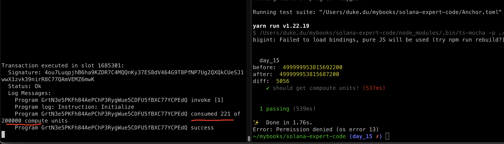
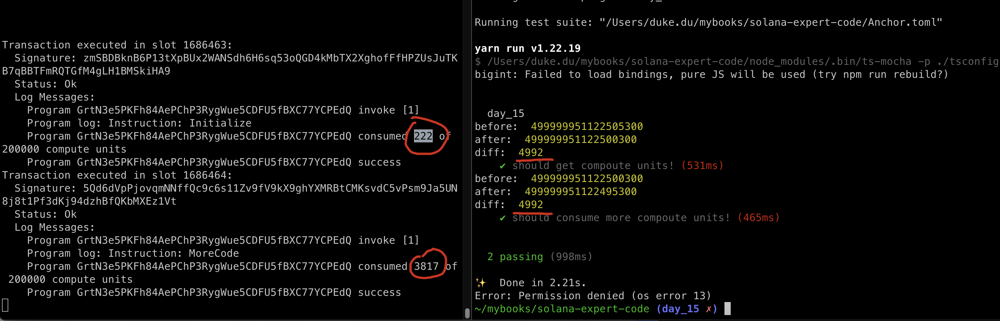

# TxFee Compute Unit

In Ethereum, the fee of a transaction is computed as `gasPrice * gasUsed`. This tells us how much in Eth will be needed, and there is a cost ceiling, gasLimit, which will protect the caller from drain his wallet by any kind of issues, such as infinite loops, the transaction will revert if it runs out of gas.


## Compute Units

Unlike on EVM chains, Solana opcodes(instructions) consume `compute units`, not gas, and each transaction is limited to 200,000 compute unites and reverts if exceed.

**Different:**

- In Ethereum, gas costs of computing are treated the same as gas costs associated with storage.
- In Solana, storage is handled differently, so the pricing of persistent data in solana is a different topic of discussion.

**Same:**

- From the perspective of pricing running opcodes, however, Ethereum and Solana behave similarly.

Both chains execute compiled bytecode and charge a fee for each instruction executed. Ethereum uses EVM bytecode, but Solana runs a modified version of **berkeley packet filter**, called Solana packet filter.

Ethereum charges different prices for different opcodes depending on how long they take to execute, ranging from one gas to thousands of gas, **however**, each opcode costs one compute unit in solana.


## Tx Fees

Even though Solana use the concept of Compoute Units(CU) to calculate the resource, but CU won't affect the fees paid for that transaction, you will be charged as if you used your entire limit or if you used very little of it. For example, a 400 compute unit transaction costs the same as a 200, 000 compute transaction, quite weird right?

In solana, the only factor that determines transction fee is **The Number of signatures** that need to be verifed in a transaction, maxminum: 12 signatures, calculation:

- one tx, max 1232 bytes.
- for each signature (64 bytes) and a pub key it refers to(32bytes)
- number of signatures: 1232 / (64 + 32) = 12.8333333333 => 12


## Try it out

```rust
anchor new day_15
```

We can see this in action with this little example, start with an empty solana program like so:

```rust
use anchor_lang::prelude::*;

declare_id!("7UsJTs46HiU3QzaHaH2eYWURXSYUZkUbWyt5m9kYyiMj");

#[program]
pub mod day_15 {
    use super::*;

    pub fn initialize(ctx: Context<Initialize>) -> Result<()> {
        Ok(())
    }
}

#[derive(Accounts)]
pub struct Initialize {}
```

update the testcase to:

```ts
import * as anchor from "@coral-xyz/anchor";
import { Program } from "@coral-xyz/anchor";
import { Day15 } from '../target/types/day_15';

describe("day_15", () => {
  anchor.setProvider(anchor.AnchorProvider.env());
  const program = anchor.workspace.Day15 as Program<Day15>;

  // replace this with your own address by run cmd: `solana address`
  const localAddress = 'HjU6xSZme7ER6Qhk841nczwXijBZ9e1GWLqdPxW6gS9w'
  const defaultKeypair = new anchor.web3.PublicKey(localAddress)

  it("should get compoute units!", async () => {
    let bal1 = await program.provider.connection.getBalance(defaultKeypair)
    console.log('before: ', bal1);

    let tx = await program.methods.initialize().rpc();
    let bal2 = await program.provider.connection.getBalance(defaultKeypair)
    console.log('after: ', bal2);
    console.log('diff: ', bal1 - bal2);
  })
})
```

result:



the `solana logs` shows only 221 CUs are consumed, yet the diff is 5056 CU by comparsion the balance before and after.


Let's add some complexity to our program and see what happens:

```rust
    pub fn more_code(ctx: Context<Initialize>) -> Result<()> {
        let mut v = Vec::new();
        for i in 0..200 {
            v.push(i);
        }
        Ok(())
    }
```

and run again:



We can see that this costs more compute units, almost 20 times our first example, but this doesn't not affect our transaction fees. This is expected and shows that truly, compute units do not affect the tx fees paid by users.

**Regardless of the compute unites comsumed, the transaction charged 49992 lamports or**

**49992*1e-9 SOL**, **PLEASE NOTE: 1 SOL = 1e9 lamport**


## Reason For CU Optimization

1. It is only now that CU won't affect the transaction fee, we can not guarantee it won't change in the future.
2. A tx with less CU consumption would be more competitive compared with the tx with higher CU consumption when there is significant network activity to be included in a block.
3. A tx with less CU comsumption will make your program more composable with other programs.If another program calls your program, you share the same compute limit(no extra), **it would be more reasonable to leave more compute units to the caller for integration.**


## Smaller integers save CU

The larger the value types used, the larger the CU consumed, so it's best to use smaller types where applicable.

add this on top of `day_15/src/lib.rs`:

```sh
use solana_program::log::sol_log_compute_units;
```

add this in `day_15/src/Cargo.toml`:

```toml
[dependencies]
anchor-lang = "0.30.1"
solana-program = "2.0.5" # Make sure the version matches your Solana toolchain
```

update the code:

```rust
    pub fn save_units(ctx: Context<Initialize>) -> Result<()> {
        // Measure compute units before any operations
        sol_log_compute_units();

        let mut v1 = Vec::new();
        for i in 0..10 {
            v1.push(i);
        }
        // Measure compute units after creating v1
        sol_log_compute_units();

        let mut v2: Vec<u64> = Vec::new();
        for i in 0..10 {
            v2.push(i);
        }
        // Measure compute units after creating v2
        sol_log_compute_units();

        let mut v3: Vec<i32> = Vec::new();
        for i in 0..10 {
            v3.push(i);
        }
        // Measure compute units after creating v3
        sol_log_compute_units();

        let mut v4: Vec<i64> = Vec::new();
        for i in 0..10 {
            v4.push(i);
        }
        // Measure compute units after creating v3
        sol_log_compute_units();

        let mut v5: Vec<u8> = Vec::new();
        for i in 0..10 {
            v5.push(i);
        }
        // Measure compute units after creating v3
        sol_log_compute_units();

        Ok(())
    }
```

run test case:


it is showed as expected, the larger value types used, the more CU costed.


This is not an exhaustive list but a few points to give an idea of what makes a program more computionally intensive than another!


## Key Takeaways

- 1 SOL = 1e9 lamport, samiliar to 1ETH = 1e9 GEWI in Ethereum.
- The Compute Units consumption of a tx won't affect it's paid transaction Fee.
- 200,000 CU limited to each solana tx(gas limit in Ethereum).
- Build the mindset to save CU in your program would be great.
- Using smaller value types applicable to save compute units.

## Links

- original article: https://www.rareskills.io/post/solana-compute-unit-price
- source code: https://github.com/dukedaily/solana-expert-code/tree/day_15
