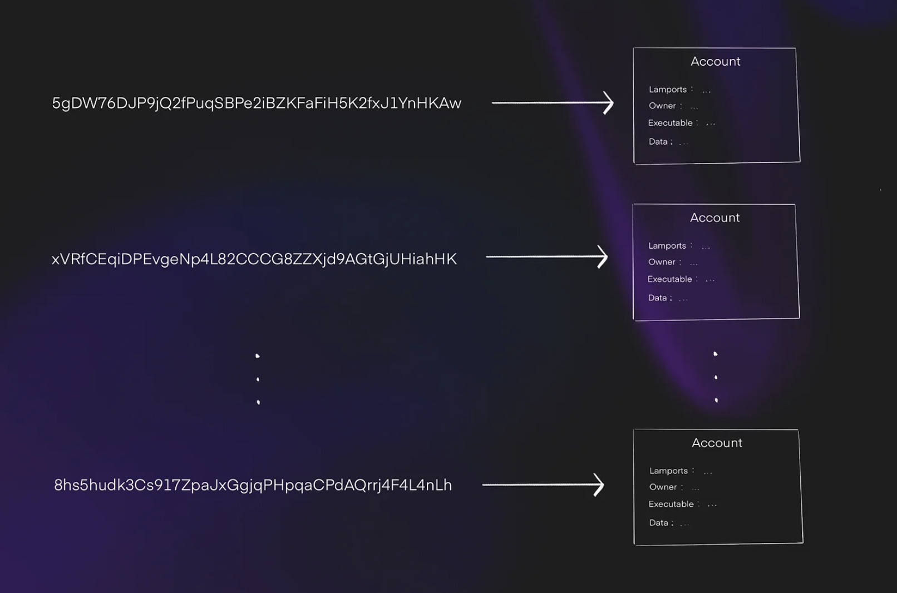
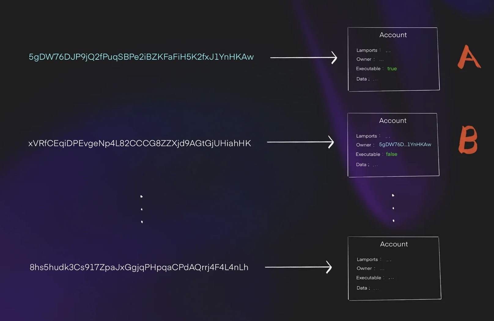
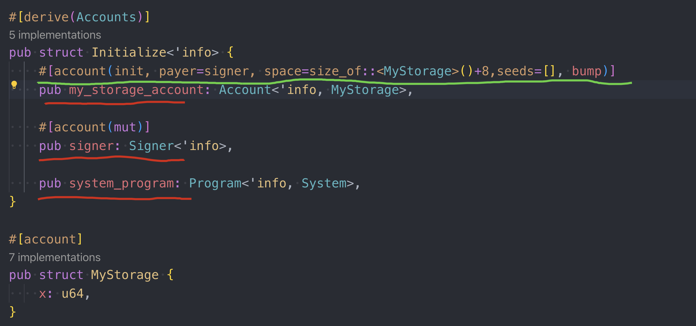
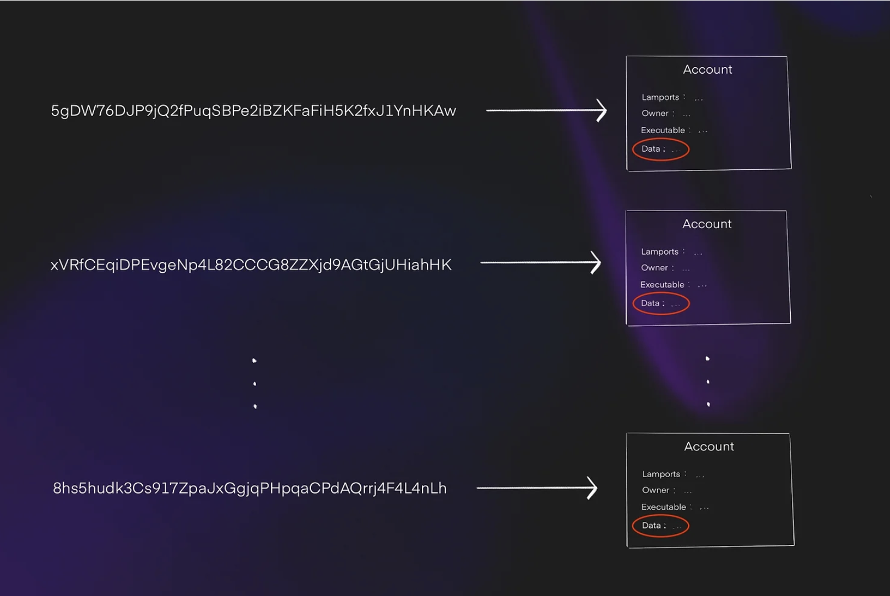
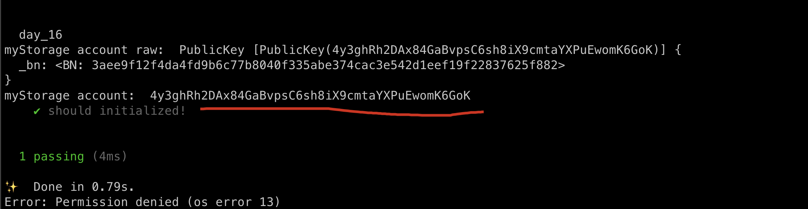
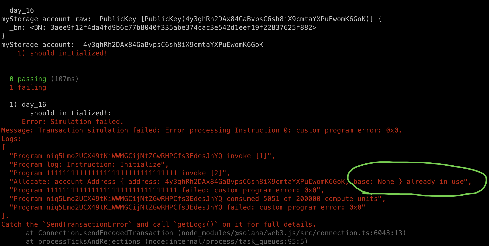

# Accounts Overview

Up until this point, none of our tutorials have used `storage variables` or store anything permanent.


Firstly, both ethereum and solana store data in the pattern of key-value.

Storage slots in Ethereum are effectively a massive key-value store:

```js 
{
  key: [smart_contract, storage solt] // 32 bytes, solts up to: 2^256
  value: 32_byte_slot // 32 bytes storage for each key
}
```

for example:

```js
contract Example {
    uint256 public var1; // Stored in slot 0
    uint256 public var2; // Stored in slot 1
}
```

Solana's model is similar, it's a massive key-value store where the "key" is a base58 encoded address and the value is a data blob that can be up to 10MB large(or optionaly hold nothing).It can be visualized as follows:

```js
{
		// key is a base58 encoded 32 byte sequence
    key: ETnqC8mvPRyUVXyXoph22EQ1GS5sTs1zndkn5eGMYWfs
    value: {
			data: 020000006ad1897139ac2bdb67a3c66a...
			// other fields are omitted
		}
}
```

## How does ethereum store

In Ethereum there are two ways to store onchain data: 

1. **store in current sc.** (sc stands for smart contract):  this is the basic way we store data, it's convinent and easy to maintain, but it's costly due to the keyword it uses: `SSTORE`.
2. **store in another sc**: this is so call `exotic design pattern`, this will need us to deploy a dedicated sc used to store data only, and be interacted with the main sc by using: `SSTORE2` or `SSTORE3`, it's gas efficient yet need more advance techniques.

Here is a example:  storate.sol:

```js
// SPDX-License-Identifier: MIT
pragma solidity ^0.8.0;

contract DataStorage {
    // The data is stored in the contract's bytecode
    constructor(bytes memory _data) {
        assembly {
            return(add(0x20, _data), mload(_data))
        }
    }
}
```

main.sol

```js
// SPDX-License-Identifier: MIT
pragma solidity ^0.8.0;

contract MainContract {
    address public dataStorageAddress;

    function storeData(bytes memory data) external {
        // Deploy the DataStorage contract with the data embedded in the bytecode
        address newDataStorage;
        assembly {
            newDataStorage := create(0, add(data, 0x20), mload(data))
        }

        // Save the address of the deployed contract
        dataStorageAddress = newDataStorage;
    }

    function retrieveData() external view returns (bytes memory) {
        uint256 size;
        bytes memory retrievedData;

        // Get the size of the bytecode at the dataStorageAddress
        assembly {
            size := extcodesize(dataStorageAddress)
        }

        // Copy the bytecode into memory
        retrievedData = new bytes(size);
        assembly {
            extcodecopy(dataStorageAddress, add(retrievedData, 0x20), 0, size)
        }

        return retrievedData;
    }
}
```

Below illustrates the basic Account Model of Ethereum:


 ```mermaid
 graph TD
     A[Block Header] --> B[State Root]
     B --> C["Global State Trie - Merkle Patricia Trie Root"]
     
     %% Account A (Smart Contract)
     C --> D[Account A]
     D --> E[Nonce: 5]
     D --> F[Balance: 10 ETH]
     D --> G["Storage Root: 0xghi789..."]
     D --> H["Code Hash: 0xdef456..."]
     
     %% Storage Trie for Account A
     G --> I["Storage Trie Root: 0xghi789..."]
     I --> J["Key 1: Value 1"]
     I --> K["Key 2: Value 2"]
     
     %% Account B (EOA)
     C --> L[Account B EOA]
     L --> M[Nonce: 3]
     L --> N[Balance: 20 ETH]
     L --> O["Storage Root: N/A"]
     L --> P["Code Hash: N/A"]
 
 ```

- Account A is a sc, it's data sotres under hash: 0xghi789...
- Account B is a EOA, no storage at all.

## How does solana store

In Solana, the data is stored in a separated sc(we call Account) by design rather a exotic design patter.

Everything is an account in solana and can potentially hold data. Sometimes we refer to one account as a **program account** or another account as a **storage account**, and the only difference is whether the `executeable` flag is set to `true` and how we intend to use the data field of the account.



In the image below, we see the accountB is owned by the program accountA. We know A is a program account because it's **executeable** field is set to `true`. This indicateds that the data field of B will be storing data for A:



## A basic storage example

Let's translate the following solidity code to solana:

```js
contract BasicStorage {
    Struct MyStorage {
        uint64 x;
    }

    MyStorage public myStorage;

    function set(uint64 _x) external {
        myStorage.x = _x;
    }
} 
```

it seems strange that we wrapped a single variable in a struct.

but in solana programs, particularly, all storage, or rather account data, is treated as a struct. The reason is due to the flexibility of the account data. Since accounts are data blobs which can be quite large(10MB), we need some `structure` to interpret the data, otherwise it is just a sequence of bytes with no meaning.

Behind the scenes, Anchor deserializeds and serializes account data into structs when we try to read or write the data.

## Account initialization

In Ethereum, we can directly write to a storage variable that we have't used before. However, Solana programs need an explicit initialization transaction. That is, we have to create the account before we can write data to it.

```sh
anchor new day_16
```

regarding to the basic storage code above, here is how it looks like in solana: (day_16/src/lib.rs)

```rust
use anchor_lang::prelude::*;
use std::mem::size_of;

declare_id!("niq5Lmo2UCX49tKiWWMGCijNtZGwRHPCfs3EdesJhYQ");

#[program]
pub mod day_16 {
    use super::*;

    pub fn initialize(ctx: Context<Initialize>) -> Result<()> {
        Ok(())
    }
}

#[derive(Accounts)]
pub struct Initialize<'info> {
    #[account(init, payer=signer, space=size_of::<MyStorage>()+8,seeds=[], bump)]
    pub my_storage_account: Account<'info, MyStorage>,

    #[account(mut)]
    pub signer: Signer<'info>,

    pub system_program: Program<'info, System>,
}

#[account]
pub struct MyStorage {
    x: u64,
}
```

we add three variables to the `Initialize` struct, let go through them one-by-one:



1. **my_storage_account**: this is where the initialization begins, it's an Account type with struct MyStorage. **'info**  is a keyword of Rust lifetime, we can ignore it for now.
2. **#[account(init,...]**: The attribute macro above the **my_storage_account** is how Anchor knows this tx is intended to initialize this account, the important keyword here is `init`.
   - `payer`: the account pays the SOL for allocating storage. PLEASE NOTE it's specified to be `mut` cos it's account balance will change, we set this to signer.
   - `space`: this indicates how much space the account will take, here we use the built-in function: `std::mem::size_of` to calculate. The +8 we will discuss later.
   - `seeds` : A program can own multiple accounts, it **disctriminates** among the accounts with the `seed` which is used in calculating a **discriminator**. The discriminator takes up 8 bytes, which is why we need to allocate the additional 8 bytes in addition to the space our struct takes up.
   - `bump`: can be treated as boilerplate for now.
3. **system_program**: this is a built-in program of Solana will account for SOL transfer, it's always part of the initialization txs(we will elaborate it in later chapters).
4. **MyStorage struct**: recall the data field inside the solana account.



under the hood, this is a byte sequence and store in the `data` field. Solana doesn't force us to use struct to use Solana accounts, but this is the convention, we don't have any reason don't use.

## Test Initialization

```ts
import * as anchor from "@coral-xyz/anchor";
import { Program } from "@coral-xyz/anchor";
import { Day16 } from '../target/types/day_16';

describe("day_16", () => {
  anchor.setProvider(anchor.AnchorProvider.env());
  const program = anchor.workspace.Day16 as Program<Day16>;

  it("should initialized!", async () => {
    const seeds = []
    const [myStorage, _bump] = anchor.web3.PublicKey.findProgramAddressSync(seeds, program.programId);
    console.log('myStorage account raw: ', myStorage);
    console.log('myStorage account: ', myStorage.toBase58());

    await program.methods.initialize().accounts({
      myStorageAccount: myStorage
    }).rpc();
  })
})
```

result:



Solana requires us to specify in advance the accounts a transaction will interact with, that's why we  compute the address of the account that stores `MyStorage` struct in the test code.

Note the seeds is an empty array, just like it is in the Anchor program.

## Account cannot be initialize twice

if we could reinitialize an account, that would be highly problematic since a user could wipe data from the syste! Thankfully, Anchor defends against this in the background.

if you run above test case again, you will get the error screenshotted below:



we can solve this by run command:

```sh
solana-test-validator --reset
```

## Predicting the account address in Solana

In Ethereum, the address of a contract created using `create2` is dependent on:

- the address of the deployer 
- a salt
- the bytecode of the created contract.

In Solana, it's pretty the same as in Ethereum except that it ignores the **bytecode**, specifically, it depends on:

- the program that owns the storage account, (here is day_16, which is anki to the deployer).
- the seeds(which is akin to create2's salt)

In all the examples in this tutorial, `seeds` is an empty array, but we will explore non-empty arrays in the following tutorial.

## Key Takeaways

- Solana uses **accounts** to store data, and each account must be initialized before it can be used.
- Once initialized, an account cannot be reinitialized
- A common way to structure the data within an account is by using a **struct**.

## Links

- original article: https://www.rareskills.io/post/solana-initialize-account
- source code: https://github.com/dukedaily/solana-expert-code/tree/day_16
