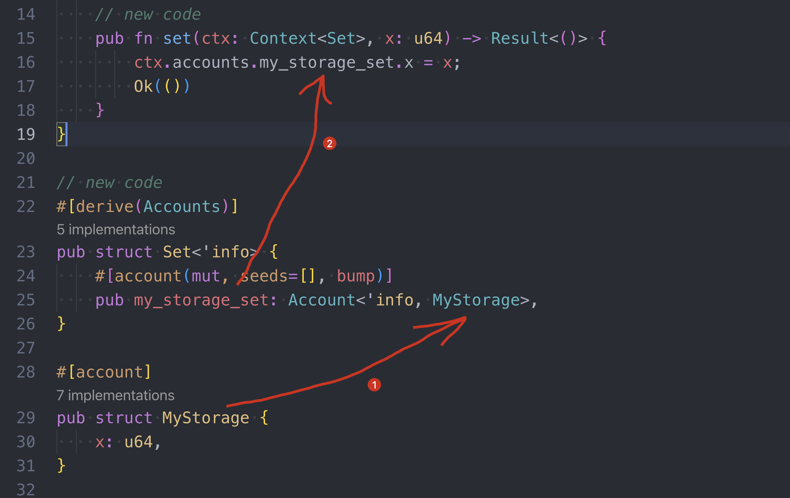
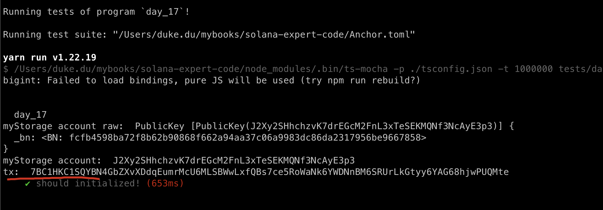
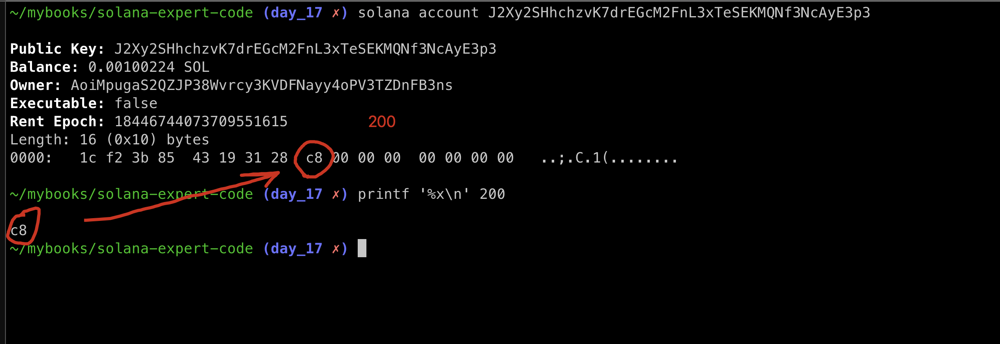

# Write to storage

In our previous tutorial, we've discussed how to initialize an account so that we could persis data in storage. Now let's discuss how to read and write to an account.


## Try it out

```sh
anchor new day_17
```

let's add an extra function  `set()` to the previous code, the rest remains unchanged:

```rust
use anchor_lang::prelude::*;
use std::mem::size_of;

declare_id!("AoiMpugaS2QZJP38Wvrcy3KVDFNayy4oPV3TZDnFB3ns");

#[program]
pub mod day_17 {
    use super::*;

    pub fn initialize(ctx: Context<Initialize>) -> Result<()> {
        Ok(())
    }

    // new code
    pub fn set(ctx: Context<Set>, x: u64) -> Result<()> {
        ctx.accounts.my_storage_set.x = x;
        Ok(())
    }
}

// new code
#[derive(Accounts)]
pub struct Set<'info> {
    #[account(mut, seeds=[], bump)]
    pub my_storage_set: Account<'info, MyStorage>,
}

#[derive(Accounts)]
pub struct Initialize<'info> {
    #[account(init, payer=signer, space=size_of::<MyStorage>()+8,seeds=[], bump)]
    pub my_storage_account: Account<'info, MyStorage>,

    #[account(mut)]
    pub signer: Signer<'info>,

    pub system_program: Program<'info, System>,
}

#[account]
pub struct MyStorage {
    x: u64,
}
```

## How function Set() works

Below, we have slightly reordered the code to show the set() function, the **Set** struct and the **MyStorage** struct close together.



when function set() is called, the `myStorage` account will be passed to `my_storage_set`, and function set will load the storage, write the new value of x, serialize the struct, then store it back.

- mut: indicates this account can be modified.
- seeds and bump: are used to derive the address of the account we will be modifying.

let's update the test case, call `set` after account initialization:

```ts
import * as anchor from "@coral-xyz/anchor";
import { Program } from "@coral-xyz/anchor";
import { Day17 } from '../target/types/day_17';

describe("day_17", () => {
  anchor.setProvider(anchor.AnchorProvider.env());
  const program = anchor.workspace.Day17 as Program<Day17>;

  it("should initialized!", async () => {
    // same to previous
    // account initialization
    
    // call set()
    const value = new anchor.BN(200)
    const tx = await program.methods.set(value).accounts({
      myStorageAccount: myStorage
    }).rpc();
    console.log('tx: ', tx);
  })
})
```

it works as expected, we will fetch x later on.



```sh
myStorage account:  J2Xy2SHhchzvK7drEGcM2FnL3xTeSEKMQNf3NcAyE3p3
```


## Viewing account outside program

We can view the account data with the following Solana command line instruction:

```sh
# solana account <MyStorage address>
solana account J2Xy2SHhchzvK7drEGcM2FnL3xTeSEKMQNf3NcAyE3p3
```



The first 8 bytes `1c f2 3b 85  43 19 31`  before `c8` are the discriminator, we can ignore as for now.


## Viewing account inside program

Reading our own storage value inside the Rust program however, is straightforward.

We add the following function

```rust
    pub fn get(ctx: Context<Get>) -> Result<()> {
        let x = ctx.accounts.my_storage_get.x;
        msg!("Value of x: {}", x);
        Ok(())
    }
```

add new Get Account

```rust
#[derive(Accounts)]
pub struct Get<'info> {
    pub my_storage_get: Account<'info, MyStorage>,
}
```

Note that we don't use `mut` in macro cos it's read only, let update the test case and test

```ts
  it.only("should get value", async () => {
    const seeds = []
    const [myStorage, _bump] = anchor.web3.PublicKey.findProgramAddressSync(seeds, program.programId);
    await program.methods.get().accounts({
      myStorageGet: myStorage
    }).rpc();
  })
```

get 200 as expected!


cool!


## Key takeaways

- don't forget to pass myStorage account during the call


## Links

- original article: https://www.rareskills.io/post/solana-counter-program
- source code: https://github.com/dukedaily/solana-expert-code/tree/day_17

