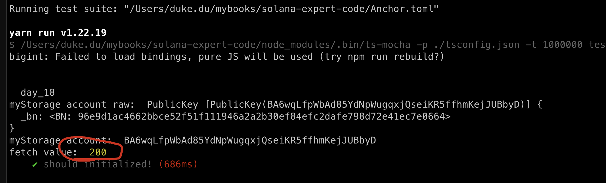
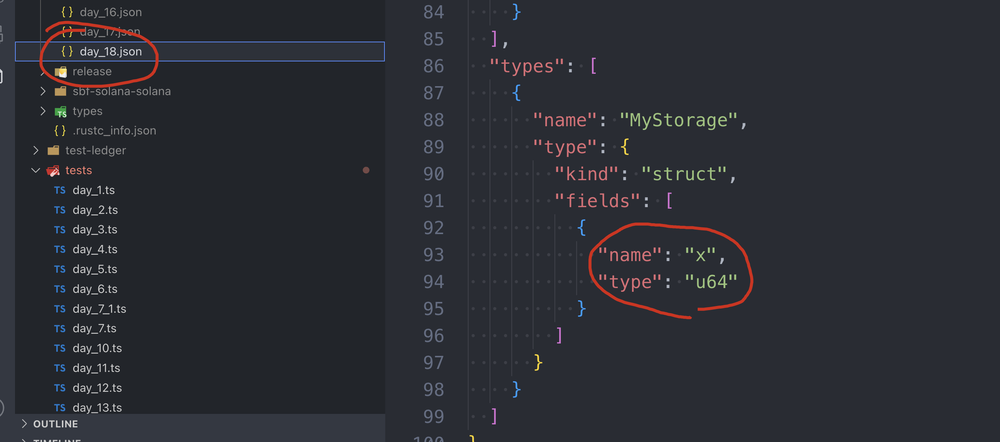
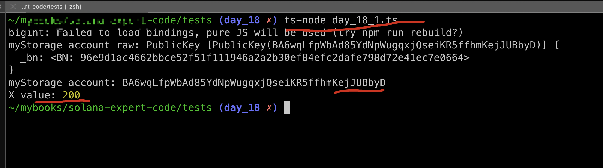
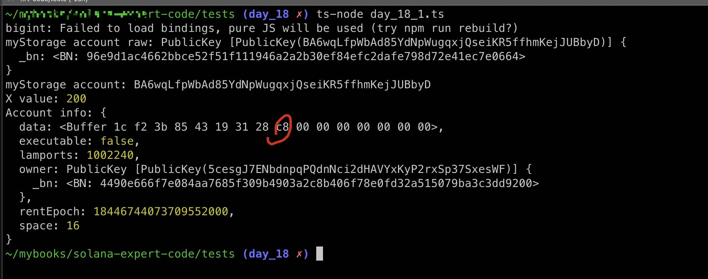

# Read account data

In this tutorial, we will discuss how to read data from Solana storage account.

in general there are 4 ways we can leverage:

1. Using command: `solana account <address> `, we showed before.
2. Reading within the contract, recall what did before in:`lib.rs`
3. **Using anchor library: this is applicable for anchor programs**, this is the commonly used one which we will focus on.
4. Fetching from raw data with solana web3 js library.


## Read In Anchor

we can create a new program with the same code as day_17(without the Get() function releated)

```sh
anchor new day_18
```

```rust
use anchor_lang::prelude::*;
use std::mem::size_of;

declare_id!("5cesgJ7ENbdnpqPQdnNci2dHAVYxKyP2rxSp37SxesWF");

#[program]
pub mod day_18 {
    use super::*;

    pub fn initialize(ctx: Context<Initialize>) -> Result<()> {
        Ok(())
    }

    // new code
    pub fn set(ctx: Context<Set>, x: u64) -> Result<()> {
        ctx.accounts.my_storage_set.x = x;
        Ok(())
    }
}

// new code
#[derive(Accounts)]
pub struct Set<'info> {
    #[account(mut, seeds=[], bump)]
    pub my_storage_set: Account<'info, MyStorage>,
}

#[account]
pub struct MyStorage {
    x: u64,
}

#[derive(Accounts)]
pub struct Initialize<'info> {
    #[account(init, payer=signer, space=size_of::<MyStorage>()+8,seeds=[], bump)]
    pub my_storage_account: Account<'info, MyStorage>,

    #[account(mut)]
    pub signer: Signer<'info>,

    pub system_program: Program<'info, System>,
}
```

add test case and run it

```ts
import * as anchor from "@coral-xyz/anchor";
import { Program } from "@coral-xyz/anchor";
import { Day18 } from '../target/types/day_18';

describe("day_18", () => {
  anchor.setProvider(anchor.AnchorProvider.env());
  const program = anchor.workspace.Day18 as Program<Day18>;

  it("should initialized!", async () => {
    const seeds = []
    const [myStorage, _bump] = anchor.web3.PublicKey.findProgramAddressSync(seeds, program.programId);
    console.log('myStorage account raw: ', myStorage);
    console.log('myStorage account: ', myStorage.toBase58());

    await program.methods.initialize().accounts({
      myStorageAccount: myStorage
    }).rpc();

    const value = new anchor.BN(200)
    const tx = await program.methods.set(value).accounts({
      myStorageSet: myStorage
    }).rpc();

    // ADD new code here!!!!
    const v = await program.account.myStorage.fetch(myStorage);
    console.log('fetch value: ', v.x.toNumber());
  })
});
```

the only difference here is adding these new lines:

```ts
    // ADD new code here!!!!
    const v = await program.account.myStorage.fetch(myStorage);
    console.log('fetch value: ', v.x.toNumber());
```

we will fetch data from the myStorage and disaply in decimalism



## IDL vs ABI

The reason Anchor can help us parse the `myStorage` struct is due to its use of IDL (Interface Definition Language), which we discussed on [day 03](../03_Anchor_Program_IDL/README.md).

An IDL serves a similar purpose to an ABI (Application Binary Interface) in Ethereum: it acts as a guide to interpret the bytecode of a program (or smart contract).



## Read Outside Anchor

Recall what we would do when we want to make a sc call in Ethereum, we will need to get two things ready: **the address** and **the abi**, and we need create a smarc-contract instance by using **ethers.js** or web3.js before we make the call.


Similarly here in Solana, we also need two things in place first:

- the program id
- the IDL

let's create a new .ts file: `day_18_1.ts` under **/tests**, assuming this is our Frontend, and we want to call x in myStorage.

```ts
import { PublicKey } from '@solana/web3.js';
import { Program, AnchorProvider, Idl, web3 } from '@coral-xyz/anchor';
import fs from 'fs';

const idlFile = fs.readFileSync('../target/idl/day_18.json', 'utf8');
const idl: Idl = JSON.parse(idlFile);

// Set environment variables
process.env.ANCHOR_PROVIDER_URL = 'http://127.0.0.1:8899';
process.env.ANCHOR_WALLET = '/Users/xxxx/.config/solana/id.json';

// Create a provider
const provider = AnchorProvider.env();

// Create the program interface
const program = new Program(idl, provider);

async function getXValueFromStorageAccount(storageAccountPublicKey: PublicKey) {
  try {
    const account = await program.account['myStorage'].fetch(storageAccountPublicKey);
    const xValue = account.x;
    console.log('X value:', xValue.toNumber());
    return xValue;
  } catch (error) {
    console.error('Error fetching storage account data:', error);
    throw error;
  }
}

// Derive the PDA for myStorage
const seeds = [];
const [myStorage, bump] = web3.PublicKey.findProgramAddressSync(seeds, program.programId);

console.log('myStorage account raw:', myStorage);
console.log('myStorage account:', myStorage.toBase58());

async function main() {
  await getXValueFromStorageAccount(myStorage);
}

main().catch(console.error);
```

here, we create a separate test file to simulate the Frontend,  initializing a program and fetch data from storage account directly.

- get myStorage address by using web3.js library.
- initializing program with idl and provider

let's run the script by the following cmd, **NOTE:**  be sure to run the code under `/tests/` folder

```sh
ts-node day_18_1.ts
```



fantastic!

## getAccountInfo

the last method to fetch data of an account it to call: `getAccountInfo`, it will return the full information of that account, including the data field.

let's add a new function to **day_18_1.ts**:

```ts
async function getXValueFromAccount(storageAccountPublicKey: PublicKey) {
  try {
    const info = await provider.connection.getAccountInfo(storageAccountPublicKey);
    console.log('Account info:', info);
  } catch (error) {
    console.error('Error fetching storage account data:', error);
    throw error;
  }
}
```

call in main()

```ts
async function main() {
  await getXValueFromStorageAccount(myStorage);
  await getXValueFromAccount(myStorage);
}
```

run above cmd again and you will get the info of this account:



this is the end, four methods to fetch data has fully covered!


## Key takeaways

- How to initialize a solana program?  **idl and program id**, we didn't set the programId cos it's already provided by the idl json file.


## Links

- original article: https://www.rareskills.io/post/solana-read-account-data
- source code: https://github.com/dukedaily/solana-expert-code/tree/day_18
